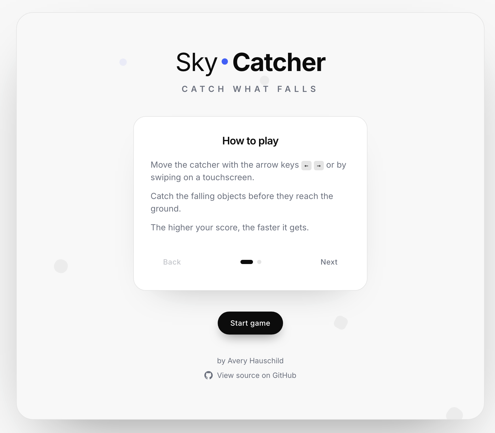

# Sky-Catcher

> A minimalist arcade catch game — move the catcher, grab what falls, chase your best score.

Built as a front-end showcase with **React 19**, **TypeScript**, **Vite** and **Tailwind CSS v4**. Runs entirely in the browser — no backend, no image assets (everything is CSS/SVG).

**[▶ Play the live demo](https://sky-catcher.vercel.app)** · [Source on GitHub](https://github.com/Avery-techdev/sky-catcher)

<!-- Add a screenshot or GIF here once deployed:  -->

---

## Highlights

- **Deterministic game engine** — all rules live in a pure, side-effect-free reducer. Randomness and time are injected as inputs, which makes the whole simulation unit-testable.
- **Frame-rate independent loop** — a `requestAnimationFrame` loop advances the game by real delta-time, so it plays the same on 60 / 120 / 144 Hz displays.
- **Single source of truth** — derived values (speed, spawn interval, difficulty) are computed, never stored. No duplicated state.
- **Accessible by default** — semantic landmarks, focus-trapped dialogs, keyboard + touch controls, live regions and full `prefers-reduced-motion` support.
- **Responsive & mobile-first** — device-tuned catcher/object sizes for comfortable touch targets without changing desktop balance.
- **Strict TypeScript** — no `any`, explicit return types, union-typed domain models.

## How to play

- **Desktop:** move the catcher with the arrow keys `←` `→`. `Space` / `Enter` start or pause, `Esc` toggles pause.
- **Mobile:** swipe anywhere to move the catcher.
- Catch the falling objects before they reach the ground. A **standard** object is worth 1 point, a **bonus** object 3. Every miss costs one of your three lives. The higher your score, the faster it gets.

## Tech stack

| Area        | Choice                                               |
| ----------- | ---------------------------------------------------- |
| UI          | React 19                                             |
| Language    | TypeScript (strict, `verbatimModuleSyntax`)          |
| Build       | Vite                                                 |
| Styling     | Tailwind CSS v4 (design tokens, central breakpoints) |
| Font        | Self-hosted Inter (via `@fontsource-variable`)       |
| Persistence | `localStorage` (highscore)                           |
| Testing     | Vitest                                               |
| Quality     | ESLint (flat, type-checked) + Prettier               |

## Architecture

Feature-based structure with a strict **UI → Hooks → Services** layering. Each feature exposes a single public API (`index.ts`); internal files stay private.

```
src/
├─ app/                     # app shell
├─ styles/                  # Tailwind entry + design tokens
└─ features/game/
   ├─ components/           # presentational only (props in, callbacks out)
   ├─ hooks/                # useGameState (state machine + loop), useGameControls, pure reducer
   ├─ services/             # gameStorageService (localStorage)
   ├─ constants/            # typed game configuration
   ├─ types/                # domain types
   └─ index.ts              # public API
```

- **Container / presentational split:** a single container (`SkyCatcherGame`) owns state via `useGameState`; every other component is presentational and receives data through props.
- **Pure logic:** `gameReducer` holds movement, collision (real body overlap), scoring, difficulty and the game-over transition — all deterministic and covered by tests.
- **Controls:** keyboard and touch are bound in one cleanup-safe effect; activation keys are ignored while a dialog/button is focused so they never double-fire.

## Getting started

Requires Node 20+.

```bash
npm install      # install dependencies
npm run dev      # start the dev server
npm run build    # type-check + production build
npm run preview  # preview the production build
npm run test     # run the unit tests
npm run lint     # lint
```

## Testing

The game logic is validated by a Vitest suite against the pure reducer: catching and missing, body-overlap collision boundaries, scoring and bonus points, life loss and game over, the countdown flow, highscore tracking and the difficulty selectors.

```bash
npm run test
```

---

Built by **Avery Hauschild** — [GitHub](https://github.com/Avery-techdev)
